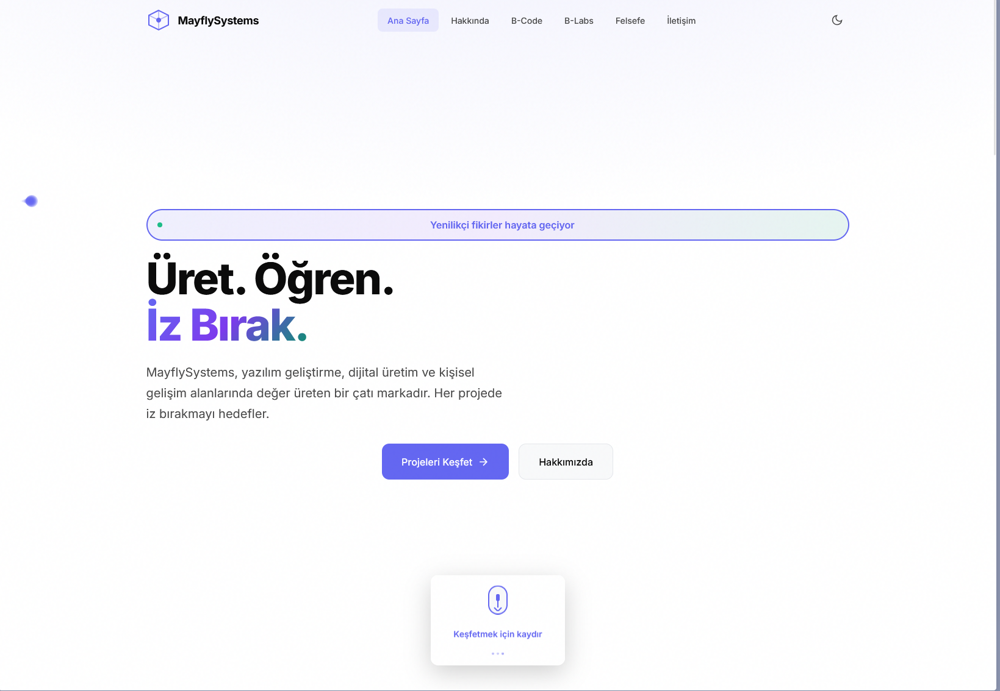
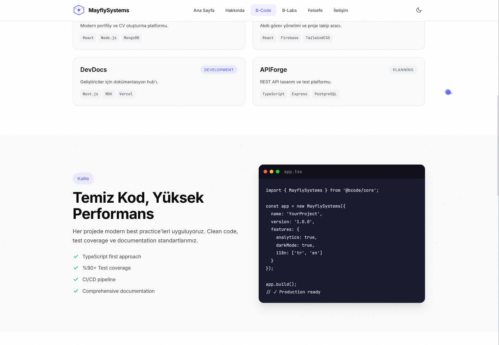

# Mayfly Systems React Website


---

## 🌟 Mayfly Systems - React Web Platform

### 🚀 Overview (English)
Mayfly Systems is a brand focused on software development, digital production, and personal growth. This React-based website showcases our innovative projects, experimental labs, and our unique philosophy: **"Create. Learn. Leave a Mark."**

- **Modern UI/UX** with smooth animations and interactive elements
- **Multi-sectioned**: Home, About, Projects (B-Code), Labs (B-Labs), Contact, Philosophy
- **Responsive** and mobile-friendly design
- **Easy to extend** for new features and content

### 🛠️ Tech Stack
- React + Vite
- Framer Motion (animations)
- CSS Modules & Custom Styles
- React Router DOM

---

## 🌟 Mayfly Systems - React Web Sitesi

### 🚀 Genel Bakış (Türkçe)
Mayfly Systems, yazılım geliştirme, dijital üretim ve kişisel gelişim alanlarında değer üreten bir çatı markadır. Bu React tabanlı web sitesi, yenilikçi projelerimizi, deneysel laboratuvarlarımızı ve özgün felsefemizi sergiler: **"Üret. Öğren. İz Bırak."**

- **Modern arayüz** ve akıcı animasyonlar
- **Çoklu bölüm**: Ana Sayfa, Hakkımızda, Projeler (B-Code), Laboratuvar (B-Labs), İletişim, Felsefe
- **Mobil uyumlu** ve responsive tasarım
- **Kolayca geliştirilebilir** altyapı

---

## 📸 Screenshots / Ekran Görüntüleri

### Home / Ana Sayfa



### B-Code Pages / B-Code Kısmı


> Replace the above image links with your own screenshots for a more professional README!

---

## 📦 Installation / Kurulum

```bash
# Clone the repository / Depoyu klonlayın
git clone https://github.com/Barand1500/Mayfly-System-React-Website.git
cd Mayfly-System-React-Website

# Install dependencies / Bağımlılıkları yükleyin
npm install

# Start the development server / Geliştirme sunucusunu başlatın
npm run dev
```

---

## 📬 Contact / İletişim
- [Mayfly Systems Website](https://mayflysystems.com)
- [mrbarand15@gmail.com](mrbarand15@gmail.com)

---

> Designed and developed with ❤️ by Mayfly Systems.